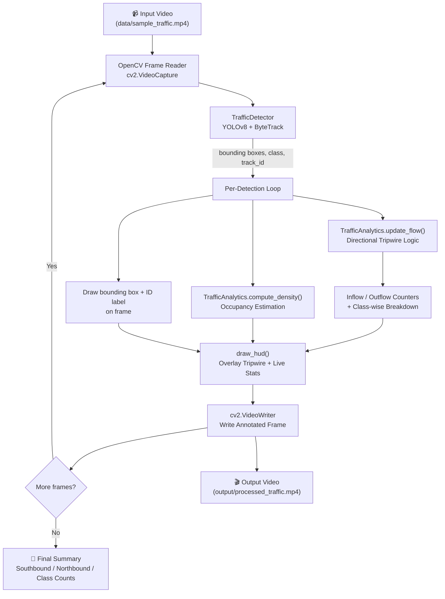

<div align="center">

# 🚦 EdgeTraffic-Vision

### Real-Time Traffic Flow & Spatial Density Analytics

*Edge-optimized computer vision pipeline for directional vehicle counting, multi-class flow classification, and roadway occupancy estimation.*


</div>

---

## 📖 Overview

**EdgeTraffic-Vision** is a headless, CLI-driven computer vision pipeline built on **YOLOv8** (detection) and **ByteTrack** (multi-object tracking). It processes traffic footage frame-by-frame to:

- Detect and persistently track **cars, buses, motorcycles, and trucks**
- Classify each tracked vehicle's motion as **Southbound (Inflow)** or **Northbound (Outflow)** using a virtual tripwire line
- Estimate **real-time roadway occupancy / congestion density** from bounding-box coverage
- Render an annotated output video with a live analytics HUD

Designed for edge/production environments — no GUI dependency, fully scriptable.

---

## ✨ Key Features

| Feature | Description |
|---|---|
| 🎯 **Multi-Class Tracking** | Persistent object IDs for car, bus, motorcycle, and truck via ByteTrack |
| ↕️ **Directional Tripwire Counting** | Classifies each track's trajectory into Southbound / Northbound flow |
| 📊 **Spatial Congestion Density** | Frame-level bounding-box occupancy ratio as a live congestion metric |
| 🖥️ **Headless CLI Execution** | No GUI overhead — ideal for servers, edge devices, and batch pipelines |
| 🎥 **Annotated Video Output** | Renders bounding boxes, track IDs, tripwire line, and a live stats HUD |

---

## 🏗️ Architecture & Workflow



### Pipeline Stages

1. **Ingestion** — `main.py` reads the source video via `cv2.VideoCapture` and prepares a matching `cv2.VideoWriter` for the annotated output.
2. **Detection & Tracking** — `TrafficDetector` (`src/detector.py`) runs `YOLOv8.track()` with the **ByteTrack** tracker, restricted to COCO classes `2 (car)`, `3 (motorcycle)`, `5 (bus)`, `7 (truck)`, returning per-object boxes, class names, and persistent track IDs.
3. **Flow Analytics** — Each detection updates `TrafficAnalytics` (`src/analytics.py`), which tracks the vertical centroid history of every ID and decides Inflow/Outflow once it crosses the tripwire line.
4. **Density Estimation** — For every processed frame, the combined bounding-box area of all active detections is compared against total frame area to estimate occupancy/congestion.
5. **Rendering** — `draw_hud()` (`src/utils.py`) overlays the tripwire line and a live stats panel (Southbound, Northbound, Occupancy %) onto each frame.
6. **Output & Summary** — Annotated frames are written to the output video; a final console summary reports total counts and the per-class vehicle breakdown.

---

## 🧮 Core Algorithms & Formulas

### 1. Bounding Box Vertical Centroid
For each tracked object with box `(x_min, y_min, x_max, y_max)`:

```
centroid_y = (y_min + y_max) / 2
```

### 2. Directional Displacement
The current centroid is compared against the object's **first recorded** centroid to determine motion direction:

```
Δy = centroid_y(current) − centroid_y(first_seen)

Δy >  5   →  Southbound (Inflow)
Δy < −5   →  Northbound (Outflow)
```
*(A ±5 px dead-zone filters out jitter/noise from near-static objects.)*

### 3. Tripwire Crossing Condition
A vehicle is only counted once its bounding box **touches or crosses** the horizontal counting line `line_y`:

```
y_min ≤ line_y ≤ y_max
```
Combined with the displacement sign above, this triggers exactly one increment per track ID (`counted_ids` prevents double-counting).

### 4. Spatial Occupancy / Congestion Density
For every processed frame, all active bounding-box areas are summed and normalized against the total frame area:

```
Area(box_i)   = (x_max − x_min) × (y_max − y_min)
Area(frame)   = frame_height × frame_width

Density = min(1.0, Σ Area(box_i) / Area(frame))

Occupancy % = Density × 100
```

This gives a `0–100%` real-time proxy for roadway congestion severity, rendered live on the HUD.

---

## 📂 Project Structure

```
edge-traffic-vision/
├── data/
│   └── sample_traffic.mp4       # Sample input video
├── src/
│   ├── detector.py              # YOLOv8 + ByteTrack detection wrapper
│   ├── analytics.py             # Flow counting & density computation
│   └── utils.py                 # HUD rendering utilities
├── main.py                      # CLI entry point / pipeline orchestrator
├── requirements.txt             # Python dependencies
├── .gitignore
└── README.md
```

---

## ⚙️ Installation & Setup

### 1. Clone the Repository
```bash
git clone https://github.com/sourimadutta321/edge-traffic-vision.git
cd edge-traffic-vision
```

### 2. Create a Virtual Environment (recommended)
```bash
python -m venv venv
source venv/bin/activate      # Windows: venv\Scripts\activate
```

### 3. Install Dependencies
```bash
pip install -r requirements.txt
```

**Dependencies:** `ultralytics`, `opencv-python-headless`, `numpy`, `pandas`, `tqdm`

> The first run will auto-download YOLOv8 weights (e.g. `yolov8n.pt`) via Ultralytics.

---

## ▶️ Usage

Run the pipeline on the default sample video:
```bash
python main.py
```

Run with custom parameters:
```bash
python main.py --source data/my_traffic.mp4 --output output/result.mp4 --model yolov8n.pt --line_y 300
```

### CLI Arguments

| Argument | Type | Default | Description |
|---|---|---|---|
| `--source` | `str` | `data/sample_traffic.mp4` | Path to input video file |
| `--output` | `str` | `output/processed_traffic.mp4` | Path for annotated output video |
| `--model` | `str` | `yolov8n.pt` | YOLOv8 weights to use for detection |
| `--line_y` | `int` | `260` | Y-coordinate of the horizontal tripwire counting line |

### Sample Console Output
```
[INFO] Running processing on data/sample_traffic.mp4...
100%|████████████████████████████| 450/450 [00:38<00:00, 11.7it/s]

--- Final Processing Summary ---
Total Southbound Count : 27
Total Northbound Count : 19
Vehicle Breakdown       : {'car': 34, 'truck': 7, 'bus': 3, 'motorcycle': 2}
Output saved to        : output/processed_traffic.mp4
```

---

## 🗺️ Roadmap

- [ ] Multi-line / multi-zone counting support
- [ ] Speed estimation via calibrated pixel-to-meter mapping
- [ ] Real-time RTSP/webcam stream support
- [ ] Exportable analytics (CSV/JSON) per session
- [ ] Web dashboard for live monitoring

---

## 🤝 Contributing

Contributions are welcome! Feel free to fork this repo, open an issue, or submit a pull request with improvements.

```bash
# Fork -> Clone -> Branch -> Commit -> PR
git checkout -b feature/your-feature-name
```

---

## 📄 License

This project is licensed under the **MIT License** — feel free to use, modify, and distribute with attribution.

---

<div align="center">

Made with ❤️ using YOLOv8 & OpenCV

</div>
